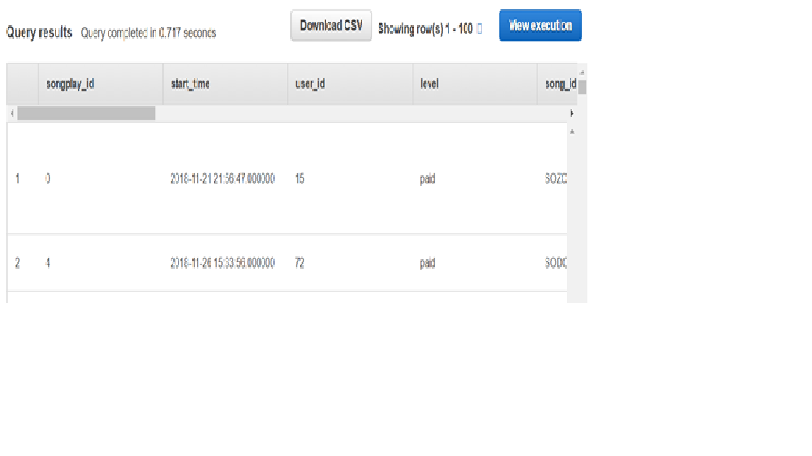
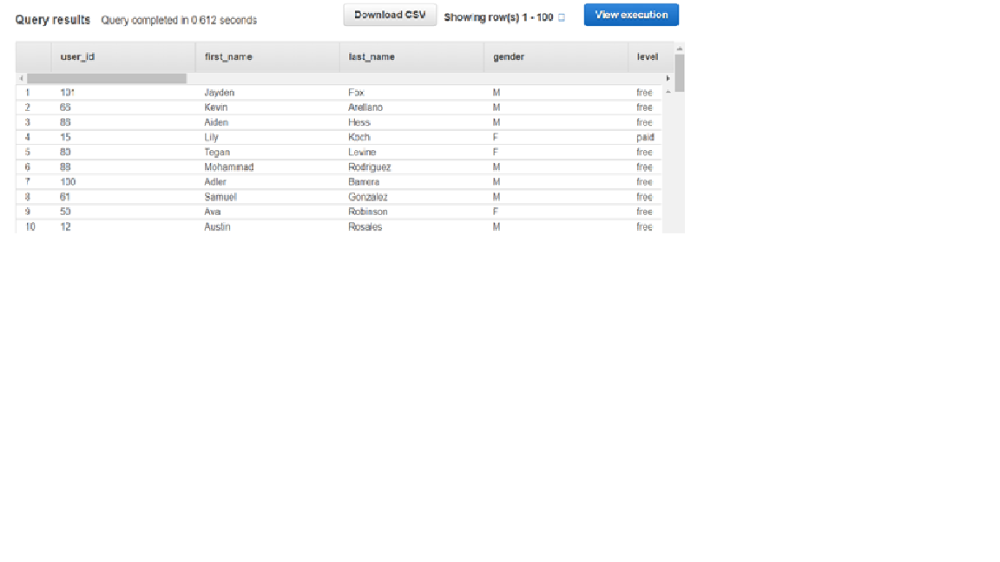

<h1>Introduction</h1>
<h3>
A music streaming startup, Sparkify, has grown their user base and song database and want to move their processes and data onto the cloud. Their data resides in S3, in a directory of JSON logs on user activity on the app, as well as a directory with JSON metadata on the songs in their app.</h3>
<h3>An ETL pipeline that extracts their data from S3, stages them in Redshift, and transforms data into a set of dimensional tables for their analytics team to continue finding insights in what songs their users are listening to</h3>

The fact table <strong><em>'songplays'</em></strong> and dimension tables schema <strong><em>'users','songs','artists' and 'time'</em></strong> are created in sql_queries.py 
The log and song data is loaded from s3 into staging_events and staging_songs table
The final table <strong><em>'songplays'</em></strong> fetches the song and artist information from staging_events and staging_songs table. The other dimension tables 'user','songs','artists' and 'time' data is also inserted either from staging_events or staging_songs 
Perform following steps to get data into the tables  
<ol>
<li>Create Redshift Cluster, IAM role and add the appropriate details in the dwh.cfg file</li>
<li>Define the schema, drop, create tables, load data from s3 and insert them in final tables in sql_queries.py</li>
<li>python create_tables.py</li>
    
This will drop any existing tables and create the fact and dimension tables

<li>python etl.py</li>
    
This python file will load the staging tables and insert records in final tables for analysis

</ol>
<strong>The below final table 'songplays' have the songs and user activity ready for the Sparkify analytical team displayed as below</strong>

<strong>The below final User Table has the user details loaded from the staging events</strong>

 