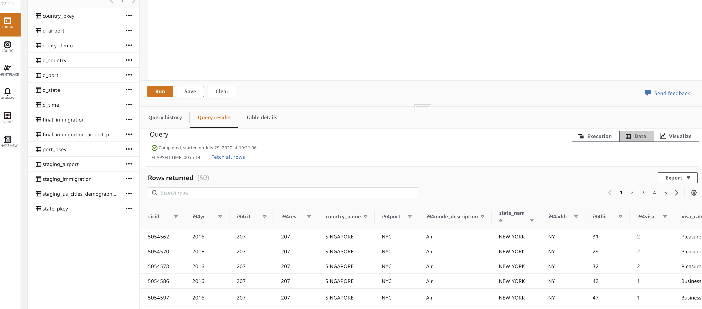

# DataEngineering_Capstone

### Project Summary
This project creates a data lake on Amazon Web Services with main focus on building a data warehouse and data pipeline. The data lake is built around the I94 Immigration data provided by the US government. The data warehouse will help US official to analyze immigration patterns to understand what factors drive people to move and also can be used for tourism purpose.

### Project Scopes
The scope of this project will be to build a data ware house on AWS that will help answer common business questions as well as powering dashboards. To do that, a conceptual data model and a data pipeline will be defined.

### Data sources
* I94 Immigration Data: This data comes from the [US National Tourism and Trade Office](https://travel.trade.gov/research/reports/i94/historical/2016.html).
* I94 Data dictionary: Dictionary accompanies the I94 Immigration Data
* U.S. City Demographic Data: This data comes from OpenSoft. You can read more about it [here](https://public.opendatasoft.com/explore/dataset/us-cities-demographics/export/).
* Airport Code Table: This is a simple table of airport codes and corresponding cities. It comes from [here](https://datahub.io/core/airport-codes#data).

### Architecture
Data are uploaded to Amazon S3. AWS will act as the data lake where all raw files are stored. Data will then be loaded to staging tables on Amazon Redshift. The ETL process will take data from those staging tables and create data mart tables. An Airflow instance can be deployed on Amazon EC2 or locally to orchestrate the pipeline.

Here are the justifications for the technologies used:

* Amazon S3: act as the data lake, vertically scalable.
* Amazon Redshift: act as data base engine for data warehousing, data mart and ETL processes.
* Apache Airflow: orchestrate the workflow by issuing command line to load data to SQL queries for ETL process. Airflow does not have to process any data by itself, thus allowing the architecture to scale.

### ETL Flow
* Data is copied to s3 buckets.
* Once the data is moved to S3 bucket, spark job is triggered which reads the data from working zone and apply transformation. Dataset is then to the Processed Zone. Used spark to trim,filter,convert datatypes after loading the data from files into the dataframes. File type includes parquet and csv files.
* Airflow ETL job picks up data from processed zone and stages it into the Redshift staging tables.
* Using the Redshift staging tables and INSERT operation is performed on the Data Warehouse tables to update the dataset.
* ETL job execution is completed once the Data Warehouse is updated.
* Airflow DAG runs the data quality check on all Warehouse tables once the ETL job execution is completed.
* Dag execution completes after these Data Quality check.
* In the final Redshift tables queries can be executed to answer following questions
   1. Most tourists are from which country
   2. Most visited state in US
   3. How long do they stay in US
   4. Travellers average age graph
   5. Travellers gender graph
   6. Less diversed states
   7. Demographics of the cities people moving to

### Environment Setup
Hardware Used

Redshift: For Redshift I used 2 Node cluster with Instance Types dc2.large

Airflow
> Using local airflow workspace

### Data model
The database is designed following a star-schema principal with 1 fact table and 6 dimensions tables.

* final_immigration: contains immigration information such as arrival date, departure date, visa type, gender, country of origin, etc.
* D_TIME: contains dimensions for date column
* D_PORT: contains port_id and port_name
* D_AIRPORT: contains airports within a state
* D_STATE: contains state_id and state_name
* D_COUNTRY: contains country_id and country_name
* D_CITY_DEMO: contains demographic information for a city

### Data pipeline
This project uses Airflow for orchestration.

A DummyOperator start_pipeline kick off the pipeline followed by 3 load operations. Those operations load data from S3 bucket to Redshift tables. The immigration_data is loaded as parquet files while the others are csv formatted. There are operations to check rows after loading to Redshift.

Next the pipeline loads 3 master data object from the I94 Data dictionary. Then the final_immigration table is created and check to make sure that there is no duplicates. Other dimension tables are also created and the pipelines finishes.

### Data Quality Checks
Data Quality Check is performed in the airflow workflow

In airflow data quality check operator is implemented and assert statements are added to validate if the dataframe has rows or not.

Some of the checks for all staging tables like staging_immigration, staging_airport etc and final fact table i.e. final_immigration

### Data dictionary
Simple and straight forward table design is chosen which will help in building simple to complex queries for analytics. Some of the data fields name have been renamed to make it meaningful and easy to understand.

[Data Dictionary](/DataDictionary/DataDictionary.xlsx)

### Scenarios
Data increase by 100x
Currently infrastructure can easily supports 100x increase in data size. Airflow is not a bottle neck since it only issue commands to other services.

Pipelines would be run on 7am daily. how to update dashboard? would it still work?
Schedule dag to be run daily at 7 AM. Setup dag retry, email/slack notification on failures.

Make it available to 100+ people
Redshift is auto-scaling so if 100+ people need to access, it can handle that easily. I

### Project Instructions
><s3bucket>/Immigration_files/addrstate
><s3bucket>/immigration_files/addrstate
><s3bucket>/Immigration_files/airport
><s3bucket>/Immigration_files/demo
><s3bucket>/Immigration_files/port
><s3bucket>/Immigration_files/rescitycntry
><s3bucket>/Immigration_files/sasdata

After executing the spark scripts to perform the transformations, data is moved to processed folder in S3

><s3bucket>/Immigration_processed_files/addrstate
><s3bucket>/Immigration_processed_files/addrstate
><s3bucket>/Immigration_processed_files/airport
><s3bucket>/Immigration_processed_files/demo
><s3bucket>/Immigration_processed_files/port
><s3bucket>/Immigration_processed_files/rescitycntry
><s3bucket>/Immigration_processed_files/sasdata

Execute Airflow locally
If everything is setup you will see the following screen

Create connection to Redshift and AWS on airflow

Trigger the dag. Below is the view of successful dag run

After the successful DAG run 1 fact and 6 dimension tables are created in Redshift. Below is view of the Data warehouse

